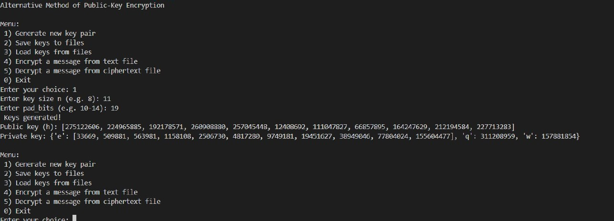
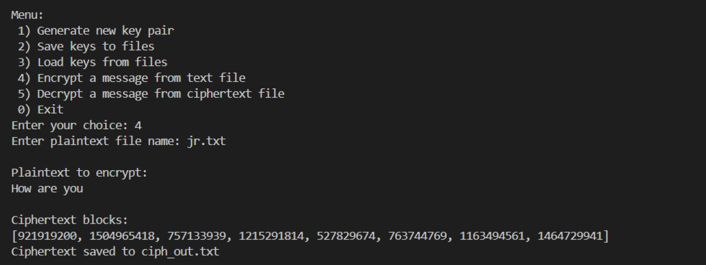
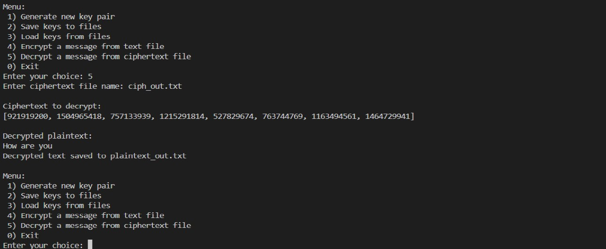

# Merkle-Hellman Knapsack Public-Key Encryption

## Overview

This project is a Python implementation of the **Merkle-Hellman Knapsack cryptosystem**, an educational public-key encryption scheme based on the subset sum problem.

The program demonstrates the full encryption workflow:

- Generation of a private superincreasing sequence
- Creation of public and private keys
- Encryption of plaintext from a text file
- Decryption of ciphertext back into readable plaintext
- Saving and loading key files for later use

The application runs through a simple command-line menu and is intended as a learning project for cryptography, public-key encryption, modular arithmetic, and secure random number generation.

---

## Features

- Generate a new public/private key pair
- Build a superincreasing sequence for the private key
- Choose a prime modulus and coprime multiplier
- Create a disguised public key using modular arithmetic
- Encrypt plaintext files into ciphertext blocks
- Decrypt ciphertext files back into plaintext
- Save keys into text files
- Load previously saved keys
- Handle missing files and invalid workflows gracefully

---

## Cryptographic Concept

The project is based on the **Merkle-Hellman Knapsack cryptosystem**.

### Private Key

The private key contains:

- `e` — a superincreasing sequence
- `q` — a prime modulus greater than twice the largest sequence value
- `w` — a multiplier coprime with `q`

### Public Key

The public key is derived using:

```text
hᵢ = (w × eᵢ) mod q
```
where:
- eᵢ is an element of the private superincreasing sequence
- w is the multiplier
- q is the modulus

## Encryption
1. Plaintext is converted into binary.
2. Bits are split into blocks based on key size.
3. Each block is encrypted by computing a knapsack sum using the public key.

## Decryption
1. Each ciphertext block is transformed using the modular inverse of w.
2. The original bits are recovered using the greedy algorithm and the superincreasing sequence.
3. Bits are regrouped into bytes and converted back into readable text.

## Requirements
- Python3.8 or later
- sympy

## Menu Options
When launched, the program displays:
```bash
Alternative Method of Public-Key Encryption

Menu:
 1) Generate new key pair
 2) Save keys to files
 3) Load keys from files
 4) Encrypt a message from text file
 5) Decrypt a message from ciphertext file
 0) Exit
 ```

## Screenshots

Key Generation



Encryption Demo



Decryption Demo




## Security Note
This repository is intended for educational and demonstration purposes.

The Merkle-Hellman Knapsack cryptosystem is useful for understanding historical public-key encryption concepts, but it should not be used to protect real sensitive data in production systems.
